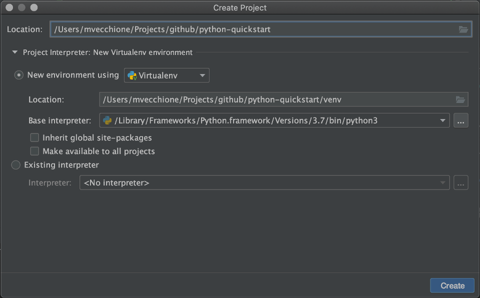

# python-quickstart
Understanding the basics of python.

### Prerequisites

#### Pycharm

Please download [pycharm](https://www.jetbrains.com/pycharm/download/).

#### Clone this repo

If you clone this repository to your local computer you may alter any of these exercise files and explore all
possibilities within the scope of each lesson.

##### 

In a command line terminal window execute the following:
```
git clone https://github.com/mvecchione145/python-quickstart.git
```
Then open pycharm and select create new project using the github repo as the base project path



## Lesson 1

Understanding data types.

[Exercise](https://github.com/mvecchione145/python-quickstart/blob/main/lesson-01.py)

### Resources

- [Data Types](https://github.com/mvecchione145/python-quickstart/blob/main/resources/data_types.md)

## Lesson 2

Understanding libraries and virtual environment.

[Exercise](https://github.com/mvecchione145/python-quickstart/blob/main/lesson-02.py)

### Resources

- [Libraries](https://github.com/mvecchione145/python-quickstart/blob/main/resources/libraries.md)
- [Virtual Environment](https://github.com/mvecchione145/python-quickstart/blob/main/resources/virtual_env.md)

## Lesson 3

Understanding functions and classes.

[Exercise-a](https://github.com/mvecchione145/python-quickstart/blob/main/lesson-03a.py)

[Exercise-b](https://github.com/mvecchione145/python-quickstart/blob/main/lesson-03b.py)

### Resources

- [Objects]()
- [Function]()
- [Class]()

## Lesson 4

Understanding how to create your own packages.

[Exercise](https://github.com/mvecchione145/python-quickstart/blob/main/lesson-04.py)

### Resources

- [Packages]()

## Lesson 5

Understanding how to create a Flask app and deploy it using [Heroku](https://www.heroku.com/home).

[Exercise](https://github.com/mvecchione145/python-quickstart/blob/main/lesson-05.py)

### Resources

- [flask]()
- [App Hosting]()

## Lesson 6

Understanding how to utilize the requests library and scrape the internet.

[Exercise](https://github.com/mvecchione145/python-quickstart/blob/main/lesson-06.py)

### Resources

- [requests](https://github.com/mvecchione145/python-quickstart/blob/main/resources/requests.md)
- [beautifulsoup](https://github.com/mvecchione145/python-quickstart/blob/main/resources/beautifulsoup.md)